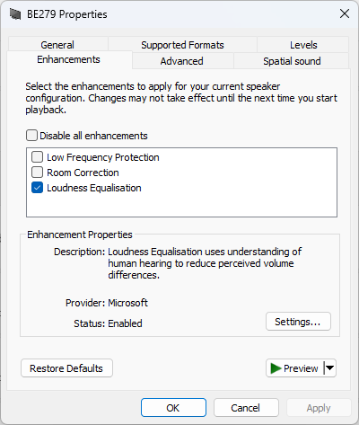

# Enable Loudness Equalisation (Windows 11 & 10)
Automatically adds, enables, and toggles **Loudness Equalisation** for any playback device in Windows.

Only works if your audio driver supports enhancements/APO for speakers, but didn't expose this support for other output devices (such as HDMI, DisplayPort, Optical Out, or USB headsets).

| Before execution | After execution |
| --------------- | -------------- |
|   |   |

---

## Features & Improvements
* **Windows 11 Pro (22H2 / 23H2 / 24H2) Compatible**: Optimized for modern Windows 11 audio endpoint architecture.
* **Auto-Detection & Listing**: View all active playback devices and their current status with `-ListDevices`.
* **Safe Substring & Special Character Matching**: Properly handles device names with parentheses and brackets (e.g., `Altavoces (Realtek(R) Audio)` or `[USB Audio]`).
* **Query Status**: Check if Loudness Equalisation is `Enabled`, `Disabled`, or `Not Configured` via `-GetStatus`.
* **Automatic UAC Elevation**: Automatically requests administrator privileges when required.

---

## How to Download and Run (PowerShell)

### 1. List Available Audio Devices
Run in PowerShell to see your active audio devices:
```powershell
.\EnableLoudness.ps1 -ListDevices
```

### 2. Enable Loudness Equalisation
Run for your device name (or a part of it):
```powershell
.\EnableLoudness.ps1 -playbackDeviceName "G432"
```

### 3. Adjust Release Time (Fast vs Slow Adjustment)
Release time ranges from **2** (fastest level adjustment, ideal for gaming/footsteps) to **7** (slowest adjustment, natural for movies):
```powershell
.\EnableLoudness.ps1 -playbackDeviceName "G432" -releaseTime 2
```

### 4. Toggle On / Off
To toggle Loudness Equalisation on or off:
```powershell
.\ToggleLoudness.ps1 -playbackDeviceName "G432"
```

To query the current status without changing anything:
```powershell
.\ToggleLoudness.ps1 -playbackDeviceName "G432" -GetStatus
```

---

## Notes on Persistence
* **Permanent Registry Changes**: Running the script **once** writes the configuration directly to `HKLM` (Windows Registry). The setting **persists permanently across PC reboots, shutdowns, and sleep**.
* You only need to run it again if you update/reinstall your audio drivers or switch playback devices.
* *(Optional)* If your setup uses HDMI/DisplayPort audio that disconnects upon monitor sleep and purges the endpoint, you can create a login task via Task Scheduler (`taskschd.msc`).

---

## Windows 11 Notes & Troubleshooting
* **Windows 11 "Audio Enhancements" Setting**: If loudness equalisation does not take effect, open `ms-settings:sound`, click on your output device, and verify that **Audio enhancements** is set to *Device Default Effects* or *On*.
* **Temporary Sound Pause**: When applying changes or toggling, the Windows Audio Service (`audiosrv`) restarts briefly (~1 second).
* **Resetting Audio Settings**: To restore default device settings:
  1. Open **Device Manager** (`devmgmt.msc`).
  2. Expand **Sound, video and game controllers**.
  3. Right-click your audio device -> **Uninstall device** (do NOT check "Delete driver software").
  4. Restart your computer.


